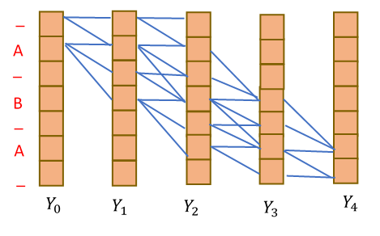

**Abstract:**  *Connectionist Temporal Classification* or CTC is a neural network output decoding and scoring algorithm that is used in sequence to sequence deep learning models. Sequence to sequence deep learning models take as input a sequence of length N and produce a output sequence of length M. CTC algorithm is used for those sequence to sequence models where M < N and the output symbols have the same order w.r.t. the input symbols i.e ouput symbols can be aligned to input seqeunce by repeating the same output symbol multiple times corresponding to a single input symbol, to form a label sequence. Label sequences are considered equivalent if they differ only in alignment. CTC scores are used with the back-propagation algorithm to update the neural network weights. This nature of CTC makes it ideal for speech recognition and Optical Character Recognition ( OCR ) tasks.
  
In this paper, we attempt to understand the principles and mathematics of *Connectionist Temporal Classiciation*. We also explore usage of CTC algorithm implemented in Keras/Tensorflow library for breaking Captch 2.0.   

## 1. Sequence to Sequence Models  

Sequence to Sequence models are deep learning models that take a sequence of symbols as input and also output a seqeunce of symbols.  Sequence to Seqeunce models are implemented as Reccurrent Neural Networks or RNNs. RNNs take X1, X2, ..., XN inputs at each time step respectively and output a label sequence Y1, Y2, ..., YM. Between  input and the output layer, there is a *hidden layer*, that passes the information about inputs from the previous timesteps to the next timestep. There are other variants of RNN, such as those which provide the output Yk as an additional input to step k+1. But for simplicity, we shall only focus on the most basic RNN implementation to understand the mechanics of CTC.  
  
  

     
  <b> Figure 1. Simple RNN </b>  
  

  
  
## 2. Understanding Connectionist Temporal Classfication    
Before delving into the details of CTC let us define some terms used in the following sections:  

**Input Sequence**: Input to the RNN in sequence to sequence models  
**Input Symbols**: Symbols in Input sequence  
**Output Sequence**: Output of the RNN after decoding or the ground truth during training.  
**Output Symbols**: Symbols in Output sequence  
**Label Sequence**: Alignment of Output Sequence to the Input Sequence. length(label sequence) = length(Input sequence)     
          
*Connectionist Temporal Classification* or CTC is a neural network output decoding and scoring algorithm that is used in sequence to sequence deep learning models. It is specifically used in models where:  
- The length of input sequence is greater than the length of output sequence
- The output sequence order corresponds to the input sequence order.

The job of CTC algorithm is to align the output symbols to the input sequence. Since the number of output symbols is less than the number of input symbols, an output symbol is repeated until the next output symbol is aligned to the input. For instance, if the input is a seqeunce of five symbols and there are only two output symbols, say, A B, the label sequence generated after aligning output could be ABBBB, AAAAB etc. As long as label sequences differ only in alignment, they are considered identical. i.e.

  

     
  <b> Figure 2. Example of CTC Alignment </b>  
  

  
 Yk, the output generated by RNN for k-th time step is the probability distribution over whole output vocabulary of seeing each symbol of the vocabulary in a label sequence L at time step k, given input symbols X0,X1,....,Xk.  
 
YDk is the probability of symbol D in the output vocabulary being the K-th symbol in the label sequence given the inputs from time steps 0 through K i.e. 
YDk = prob(Lk = D | X0,X1,....,Xk).

CTC algorithm takes the probabilty distribution across all vocabulary symbols at all time steps and decodes the label sequence from it. The following sections will explain various strategies that can be used to align the output symbols to input seqeunce to form a label sequence. 

### 2.1. Alignment Strategies for Model Training

While it is obvious that we can use crossentropy loss for each time-step to train the model; it is not clear as to how to align the output symbols w.r.t. the input sequence to enable us to calculate the loss. Following are the most common approaches used: 

#### 2.1.1. Greedy Approach    
The simplest alignment strategy is to choose the output symbol in the vocabulary with the greatest probability in the probability distribution for the particular timestep. For a time step K, the output symbol in the label sequence Lk can be found as follows:

Lk = argmax Yk

While for simple tasks this strategy might work, it can create issues for tasks wherein there could be constraints w.r.t. the output symbols that can be adjecent to each other in the label sequence. A purely greedy approach can result in invalid label sequences being produced for such cases. To solve this issue alternative approaches are used which are described below.

#### 2.1.1. Most Probable Label Sequence

To ensure that the label sequence generated by CTC is valid and satisfies the specified constraints , a graph is constructed whose nodes are the symbols in Yk. Symbols Y at any step k are constraint to the output symbols provided in the training set. If a symbol is present multiple times in output training sequence it is reprsented as many times as distinct node at each time step. Each node keeps track of :  
- The best incoming edge  
- The score of the best path from the start to the node.  
  
For example, for a 5-step input sequence, if the output sequence is only of length three i.e. ABA, each timestep is restricted to only three symbols from the vocabulary. All possible valid transitions are marked in blue below:  

  
 
     
  <b> Figure 3. Path Constraints  </b>  
  

 
 Since the number of valid paths can be expotential, the mechanism to find the best path uses dynamic programming approach like the ***Viterbi Algorithm***.    
 
 ---
 
 Model training goes as follows:  
 
 1. Perform the forward pass of the model to get Yk for k = 1 to n, where n = number of input symbols.    
 2. Extract only the output symbols from Yk  
 3. Use the Viterbi algorithm to find the alignment  of output symbols to input sequence to form a Label Sequence
 4. Using the symbols identified the label sequence, cross-entropy loss is calculated as follows:  
   LXentropy = -&sum; k log Yk  bestpath   
 5. Model weights are updated by performing back propagation using &nabla; LXentropy  
 6. Goto step 1 until LXentropy < predefined value  
 
 ---
 
 While using the most probable path to decide on the alignment of the output symbols w.r.t. the input sequence provides acceptable results and used in many tasks, the training is sensitive to the initial alignment. If the initial alignment is not suitable, the training could converge to a bad local optima. To address the issue, instead of choosing the most probable path, an alternative is to chose expected path. 

#### 2.1.2. Expectation Maximization    

Choosing expectated alignment at each iteration instead of the most probable alignment is more statistically robust and prevents the solution to converge to a bad local optima.

Loss = E[ &minus; &sum; k log( Yk(S = Sr ) ]

Due to linearilty of expectation:  
&emsp;&emsp;&emsp;&emsp; = &minus; &sum; k E [ log( Yk(S=Sr ) ]

&emsp;&emsp;&emsp;&emsp; = &minus; &sum; k &sum;  Sr  P(S=Sr \|S, X )log( Yk(S =Sr ) where S is a output sequence and X is input sequence  

P(S k =Sr \|S, X ) &prop; P(S=Sr , S \| X )  
  
P(S=Sr, S \| X ) is the total probability of all valid paths in the graph for output sequence S that go through the symbol Sr at timestep k.
 
 P(S=Sr , S \| X )  for all Sr &in; S is calculated using ***Forward Backward algorithm***
  
### 2.2. Handling Repetitions

As explained earlier, label sequences that differ only in their alignment are considered equivalent e.g. Label sequences AABAA and ABBAA are both equivalent and decoded as ABA by CTC, collapsing the symbol repetitions into a single symbol. This however, creates a problem in handling cases wherin the output symbols contain repetitions. The repetitions will be collapsed to a single symbol. This problem is addressed by introducing a new symbol **'_'** to the CTC hierarchy.  

Each output symbol in the Figure-3 is preceded and followed by the new symbol **'_'**. The constraint graph is modified as follows 

  

     
  <b> Figure 4. Handling Repetitions </b>  
  

  
 Symbols separated by '\_' are not collapsed. Hence repetitions are learned by the network such that they are separated by '\_'. The output sequence ABA in the graph above can result in label sequence _A_BA, ABA_ _, AB_A etc.
 
 For output sequences that contain repetitions, e.g.  AABC,  a different graph would generate a possible label sequence as A_A_BC. Since repeated symbols around **'_'** are not callpsed, it is decoded  as  AABC.   
 
  
### 2.3. Variants of CTC

There are many variations of CTC described above that can be used in sequence to sequence model:  

- Instead of just the hidden layer from the previous timestep and input to the current timestep , the model takes the output of the previous timestep and input to the current timestep  
- Bi-ditectional LTSM model can also be used instead of vanilla RNN.
  
- Instead of greedy search and approximate search algorithm called beam search can also be used for more complex tasks. Refer [2],[3] for more details on beam search  

## 3. Using CTC to Break Captcha 2.0

This section gives overview of the project files to break the Captcha 2.0 codes using implementation of CTC decoding in Keras/Tensorflow. 

***captcha_model.py***  contains implementation of :   

-  **CaptchaModel** : It is a custom Keras model that :  
    - Downsamples the image using 2D convolutions and max-pooling 
    - The width of the downsampled image is equal to the timesteps of the two bi-directional LTSMs to which the downsampled image is fed as input.
    - The output of each timestep is the probability distribution of occurance of output symbol accross the complete vocabulary.
    -  As the model extends the tf.keras.Model class, the standard *predict* and the *evaluate* functions are used to make prediction and evaluate the model. 

-  **loss_func** :   It is a custom loss function that uses the tensorflow implementation of CTC to calculate CTC loss

-  **CTCAccuracy** : This is a custom accuracy metrics that calculates accuracy as the hamming distance between the ground truth and predicted captcha.  

***ctc_study.py***  contains the training and evaluation of the CaptachaModel

***captcha_dataset.py***  contains the implementation to read the captcha dataset

## References  
1. [S18 Lecture 14: Connectionist Temporal Classification (CTC)](https://www.youtube.com/watch?v=c86gfVGcvh4&t=2865s)  
2. [C5W3L03 Beam Search](https://www.youtube.com/watch?v=RLWuzLLSIgw&t=12s)  
3. [Refining Beam Search](https://www.youtube.com/watch?v=gb__z7LlN_4)  

 
 
 

