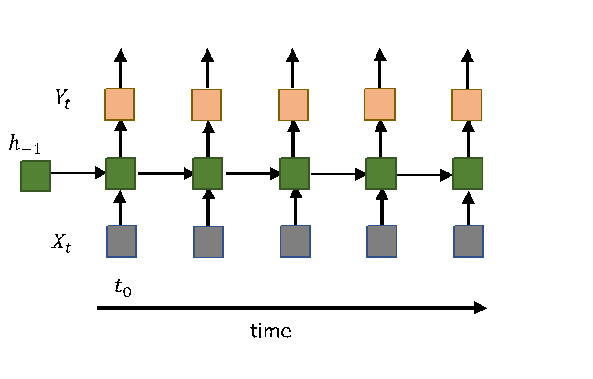

**Abstract:**  *Connectionist Temporal Classification* or CTC is a neural network output decoding and scoring algorithm that is used in sequence to sequence deep learning models. Sequence to sequence deep learning models take as input a sequence of length N and produce a output sequence of length M. CTC algorithm is used for those sequence to sequence models where M < N and the output symbols have the same order w.r.t. the input symbols i.e ouput symbols can be aligned to input seqeunce by repeating the same output symbol multiple times corresponding to a single input symbol, to form a label sequence. Label sequences are considered equivalent if they differ only in alignment. CTC scores are used with the back-propagation algorithm to update the neural network weights. This nature of CTC makes it ideal for speech recognition and Optical Character Recognition ( OCR ) tasks.
  
In this paper, we attempt to understand the principles and mathematics of *Connectionist Temporal Classiciation*. We also explore usage of CTC algorithm implemented in Keras/Tensorflow library for breaking Captch 2.0.   

## 1. Sequence to Sequence Models  

Sequence to Sequence models are deep learning models that take a sequence of symbols as input and also output a seqeunce of symbols.  Sequence to Seqeunce models are implemented as Reccurrent Neural Networks or RNNs. RNNs take X1, X2, ..., XN inputs at each time step respectively and output a label sequence Y1, Y2, ..., YM. Between  input and the output layer, there is a *hiddent layer*, that passes the information about inputs from the previous timesteps to the next timestep. There are other variants of RNN, such as those which provide the output Yk as an additional input to step k+1. But for simplicity, we shall only focus on the most basic RNN implementation to understand the mechanics of CTC.  
  
  

     
  <b> Figure 1. Simple RNN </b>  
  

  
  
## 2. Understanding Connectionist Temporal Classficiation    
*Connectionist Temporal Classification* or CTC is a neural network output decoding and scoring algorithm that is used in sequence to sequence deep learning models.  It is sepcifically used in models where:  
- The length of input sequence is greater than the length of output sequence
- The output sequence order corresponds to the input sequence order.

The job of CTC algorithm is to align the output symbols to the input sequence. Since the number of output symbols is less than the number of input symbols, an output symbol is repeated until the next output symbol is aligned to the input. For instance, if the input is a seqeunce of five symbols and there are only two output symbols, say, A B, the label sequence generated after aligning output could be ABBBB, AAAAB etc. As long as label sequences differ only in alignment, they are considered identical. i.e.

  

     
  <b> Figure 2. Example of CTC Alignment </b>  
  

  
 Yk, the output generated by RNN for k-th time step is the probability distribution over whole output vocabulary of seeing each symbol of the vocabulary in a label sequence L at time step k, given input symbols X0,X1,....,Xk.  
 
YDk is the probability of symbol D in the output vocabulary being the K-th symbol in the label sequence given the inputs from time steps 0 through K i.e. 
YDk = prob(Lk = D | X0,X1,....,Xk).

CTC algorithm takes the probabilty distribution across all vocabulary symbols at all time steps and decodes the label sequence from it. The follwing sections will explain various strategies that can be used to align the output symbols to input seqeunce to form a label sequence. 

### 2.1. Alignment Strategies for Model Training

While it is obvious that we can use crossentropy loss for each time-step to train the model; it is not clear as to how to align the output symbols w.r.t. the input sequence to enable us to calculate the loss. Following are the most common approaches used: 

#### 2.1.1. Greedy Approach    
The simplest alignment strategy is to choose the output symbol in the vocabulary with the greatest probability in the probability distribution for the particular timestep. For a time step K, the output symbol in the label sequence Lk can be found as follows:

Lk = argmax Yk

While for simple tasks this strategy might work, it can create issues for tasks wherein there could be constraints w.r.t. the output symbols that can be adjecent to each other in the label sequence. A purely greedy approach can result in invalid label sequences being produced for such cases. To solve this issue alternative approaches are used which are described below.

#### 2.1.1. Most Likely Output Sequence

To ensure that the label sequence generated by CTC is valid, the symbols in Yk Y at any step k are constraint to the output symbols provided in the training set.

For example, for a 5-step input sequence, if the output sequence is only of length three i.e. ABA, all possible valid transitions are marked in blue below.  

  

     
  <b> Figure 1. Simple RNN </b>  
  

  

#### 2.1.2. Expectation Maximization    

### 2.2. Beam Search 

 
 
 

